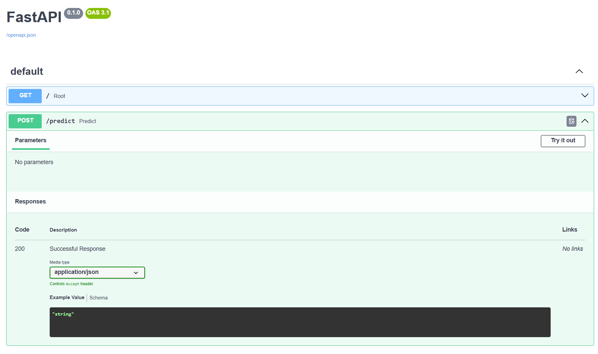
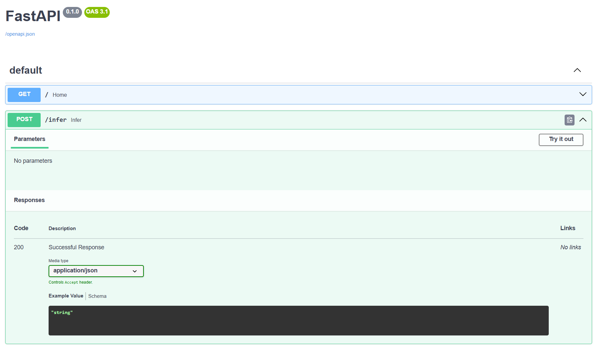
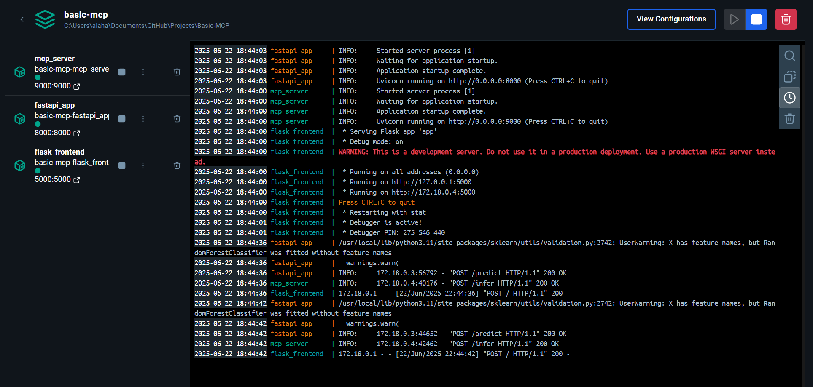
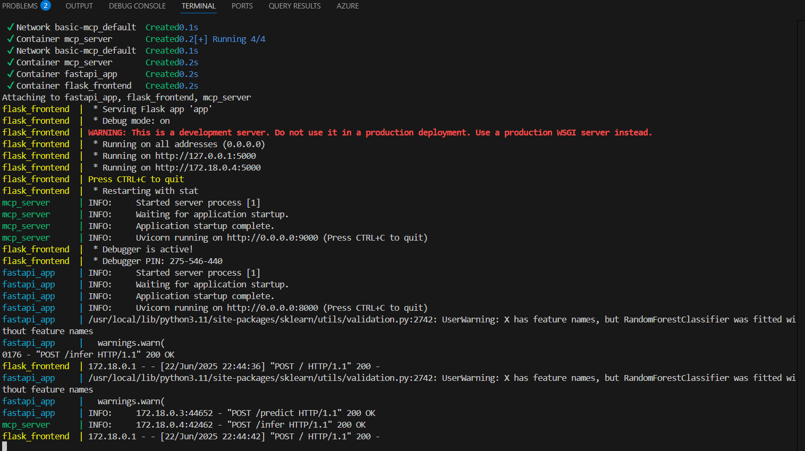
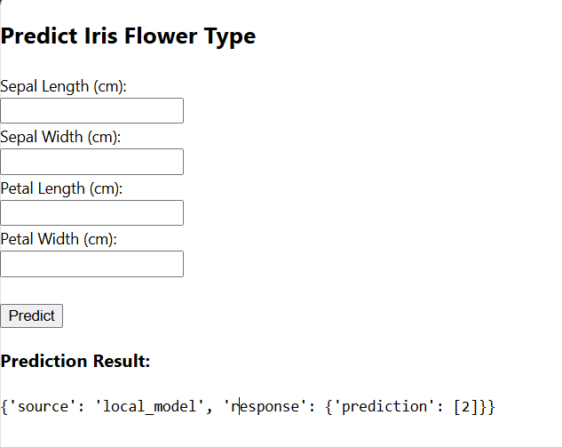

# ML Local Model Inference with FastAPI + MCP + Flask


A modular, Dockerized machine learning system integrating FastAPI (for local ML), Flask (for user interface), and an MCP (Model Control Proxy) server to orchestrate inference across components.

---

## 📌 Overview

This project demonstrates a complete ML inference pipeline using microservices. A local ML model is deployed via FastAPI for classification, and an MCP server routes inference requests to the model and responds with predictions. A Flask frontend enables users to input values and visualize results in a browser.

The application was built for local inference with potential extensibility toward hybrid LLM + local deployment.

---

## 📷 Screenshots

1. 🔘 FastAPI Documentation  
   

2. 🔘 MCP Server Swagger UI  
   

3. 📦 Docker Containers Running  
   

4. 🧪 VS Code + Terminal Logs  
   

5. 🌐 Web UI Output from Flask  
   

---

## ⚙️ Architecture

```
                 ┌────────────────────┐
                 │    Flask UI        │
                 │ (User Input Form)  │
                 └────────┬───────────┘
                          │
                          ▼
                 🔁 POST to MCP /infer
                          │
        ┌─────────────────┼───────────────────┐
        ▼                 ▼                   ▼
  🔹 Local ML       🔹 MCP Server       🔹 Flask Frontend
  (FastAPI + Sklearn)   (Routing)        (User Output)

        │                 │                   │
        │ ←──── /predict  │                   │
        ▼                 ▼                   ▼
    Predict using     Processed in         Display final
    trained model     orchestrator         prediction
```

---

## 🧠 Why This Architecture?

This project uses a **modular microservice architecture** built with Docker, FastAPI, and a custom MCP server to ensure clean separation of concerns and maximum flexibility.

### 🐳 Docker: Portability & Isolation
- Each component runs in its own isolated environment.
- Eliminates dependency issues and ensures consistent behavior across environments.
- Easily scalable and deployable to cloud platforms or container orchestration systems (e.g., Kubernetes).

### ⚡ FastAPI: Lightweight, High-Performance ML API
- Serves the machine learning model with ultra-fast response times.
- Auto-generates Swagger UI and type-validated endpoints.
- Ideal for inference use cases thanks to async support and simplicity.

### 🔁 MCP Server: Smart Routing & Future-Proofing
- Acts as a middleware that routes user input to the correct model or backend service.
- Enables hybrid setups (e.g., combining local ML with Gemini/LLM APIs).
- Decouples the UI from model logic — making the system easier to maintain and extend.

### 🧩 Why Not Just Use Flask Alone?
While Flask is great for UI, trying to run the ML model, routing, and UI in a single Flask app can lead to:
- **Monolithic codebases** that are hard to test or maintain.
- **Limited scalability** — every new feature risks breaking existing logic.
- **Harder deployment** — changing one part requires rebuilding the whole.

---

## ✨ Features

* FastAPI server serving a local `sklearn` classification model
* Flask form-based input UI
* MCP server routing logic to forward requests
* Dockerized microservice architecture with 3 containers
* Swagger UI for FastAPI and MCP endpoints
* Simple and extendable codebase

---

## 🛠️ Tech Stack

* **Backend**: FastAPI (Python)
* **Frontend**: Flask
* **Orchestration**: MCP Server (FastAPI-based)
* **Model**: Scikit-learn (Naive Bayes/RandomForest)
* **Containerization**: Docker, Docker Compose
* **Other**: HTML, Uvicorn, joblib

---

## 🗂 Project Structure

```
Basic-MCP/
├── fastapi_app/
│   ├── main.py
│   ├── model.joblib
│   └── train_model.py
│
├── mcp_server/
│   └── orchestrator.py
│
├── flask_frontend/
│   ├── app.py
│   └── templates/
│       └── form.html
│ 
├── gemini_client/
│   └── gemini_api.py
│ 
├── docker/
│   └── Dockerfile
│
├── docker-compose.yml
├── requirements.txt
├── README.md
└── images/
    └── *.png (Screenshots)
```

---

## ⚙️ Setup & Installation

### Clone the Repo

```bash
git clone https://github.com/yourusername/ml-local-inference.git
cd ml-local-inference
```

### Build Docker Containers

```bash
docker compose up --build
```

This will start:

* FastAPI ML model on port `8000`
* MCP server on port `9000`
* Flask UI on port `5000`

---

## 🚀 Usage

### 1. Open the Flask UI

Visit: [http://localhost:5000](http://localhost:5000)

Submit feature inputs, and you’ll see predictions returned.

### 2. Swagger Documentation

* [FastAPI Docs](http://localhost:8000/docs)
* [MCP Server Docs](http://localhost:9000/docs)

### 3. Curl Testing

**FastAPI directly:**

```bash
curl -X POST http://localhost:8000/predict   -H "Content-Type: application/json"   -d "{"text": "This is a sample document."}"
```

**MCP routed inference:**

```bash
curl -X POST http://localhost:9000/infer   -H "Content-Type: application/json"   -d "{"document_text": "This is a sample.", "user_query": "Summarize"}"
```

---

## 🐳 Dockerized Environment

The services are containerized using a single Dockerfile located in the `docker/` folder. It uses build arguments or context switching to serve different roles if needed.

* `Dockerfile` → Builds the appropriate environment for FastAPI, MCP, and Flask apps depending on context.

All are configured in `docker-compose.yml`.

---

## 🧪 Extending the Project

* Swap out local ML with a better model (XGBoost, BERT)
* Add Gemini/LLM API routing from MCP
* Enable PDF uploads with document parsing
* Plug in RAG + vector store (Qdrant)

---

## 📜 License

Licensed under the [MIT License](https://opensource.org/licenses/MIT)